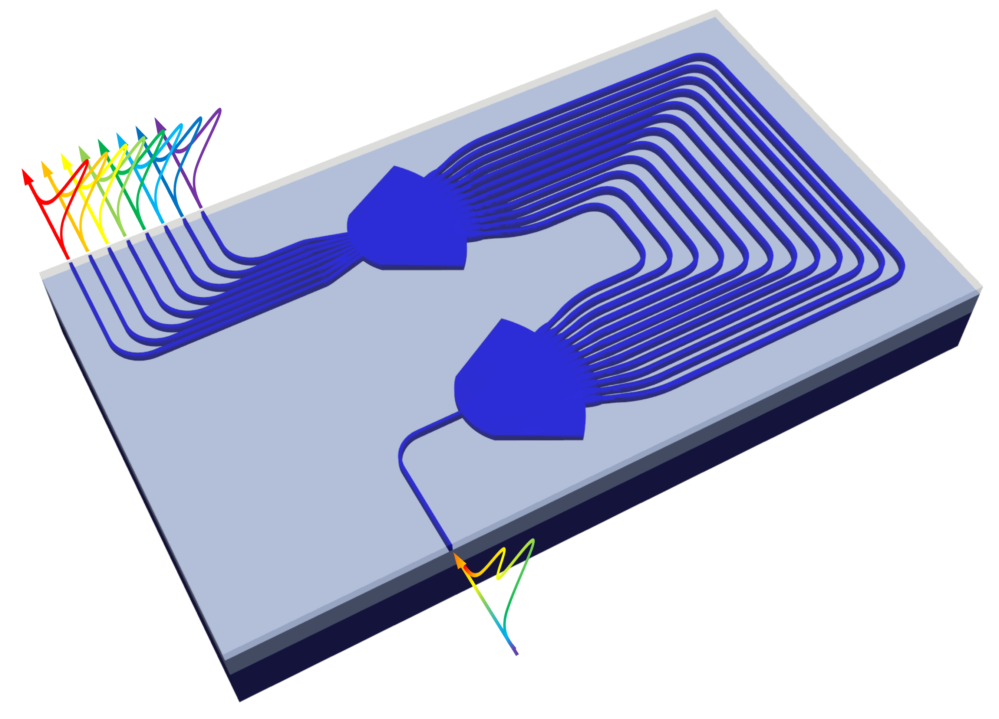

# Get started

想要查看全部文档请浏览 [Zensical](https://zensical.org/docs/)。

参考 [Tidy3D 官方文档](https://www.flexcompute.com/tidy3d/)。


网页链接的另一种写法：
[Zensical][new]

[new]: https://zensical.org/docs/

!!! warning

    这个是一个注意事项

!!! note

    这个是注意事项

```python 
import tidy3d as td

mode_spec = td.ModeSpec(
    num_modes=1
)
```

> Go to documentation...
> 这个
> 第三行

Here's a sentence with a footnote.[^1]

[^1]: This is the footnote.

==highlight==

^^underline^^

~~deleted~~

H~2~O

A^T^A

$$
n_\mathrm{eff} = \frac{\beta}{k_0}
$$

这个是行内公式 $k_{0}+2=e^{4}$


{ width="70%" align=center}

<p align="center">
    
    <br>
    <em>AWGForge Schematic Diagram</em>
</p>
